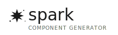

A conversational component generation system for Cursor IDE that creates production-ready UI components through natural language interaction.

**Built by Fueled** | **Designed for Teams** | **Production-Ready Components**

## Quick Start

### Installation

```bash
git clone https://github.com/devinle/spark.git
cd spark
chmod +x install.sh
./install.sh
```

### Non-Interactive Installation

For automated environments (CI/CD, scripts), use the non-interactive mode:

```bash
# From your project directory
/path/to/spark/install.sh --non-interactive

# Or set environment variable
NON_INTERACTIVE=true /path/to/spark/install.sh
```

The installation script will:
- Detect your project type (React, WordPress, HTML, etc.)
- Create the necessary `.cursor/rules` directory structure
- Install Spark rules for Cursor IDE
- Set up proper permissions

### Usage

Open Cursor IDE and start chatting:

```
@spark                    # Let's chat about what you need
@spark accordion          # Create an accordion component
@spark faq                # Quick FAQ accordion
@spark product-card       # E-commerce product card
@spark help               # Show all options
```

## What You Get

**Four Production-Ready Components:**
- 📋 **Accordion** - Collapsible sections for FAQs, content organization, step-by-step guides
- ⬜ **Card** - Content containers for blog posts, products, profiles, media displays  
- ⭕ **Carousel** - Image sliders for galleries, testimonials, hero banners, content rotation
- 💬 **Dialog** - Modals and popups for confirmations, lightboxes, contact forms, alerts

**Multiple Technology Stacks:**
- React (TypeScript & JavaScript)
- WordPress (PHP)
- Vanilla HTML/CSS/JavaScript
- Web Components

**Built-in Best Practices:**
- WCAG 2.2 AA accessibility compliance
- Mobile-first responsive design
- Performance optimizations (CLS prevention, lazy loading)
- Modern JavaScript patterns
- BEM CSS methodology
- Production-ready code quality

## Features

- **Conversational Interface**: Natural language interaction with Cursor IDE
- **Smart Project Detection**: Automatically detects React, WordPress, HTML, and other project types
- **Accessibility First**: WCAG 2.2 AA compliant components
- **Multiple Frameworks**: Works with React, WordPress, and vanilla HTML/CSS/JS
- **Production Ready**: Optimized code with best practices built-in

## Installation Requirements

- **Cursor IDE** (required) - Spark integrates with Cursor's Chat Agent interface
- **Git** - For installation and updates
- **Node.js 16+** (for React/TypeScript components)
- **PHP 7.4+** (for WordPress components)

### Important: How Spark Works with Cursor IDE

Spark is **not** a command-line tool. It works exclusively through Cursor IDE's chat interface:

- **`@spark`** - Chat trigger within Cursor IDE (not a CLI command)
- **`@cursor`** - Separate CLI tool to launch Cursor IDE (not related to Spark)
- **No terminal commands** - All interaction happens in Cursor's chat panel

Works with any project type:
- Next.js / React applications
- WordPress themes and plugins
- Static HTML sites
- Node.js projects
- Monorepos

## Available Components

Spark generates four core UI components:

### Accordion
Collapsible sections perfect for FAQs, product details, and step-by-step guides
- Accessible keyboard navigation
- Smooth animations
- Multiple open/close patterns

### Card
Content containers for products, blog posts, team profiles, and media displays
- Responsive layouts
- Image optimization
- Action button support

### Carousel
Image sliders for galleries, testimonials, hero banners, and content rotation
- Touch/swipe support
- Auto-play options
- Navigation controls

### Dialog
Modals and popups for confirmations, lightboxes, contact forms, and alerts
- Focus management
- Escape key handling
- Backdrop interactions

## How It Works

Spark integrates with Cursor IDE through a simple rule system that:

- Detects your project type automatically
- Provides conversational component generation
- Supports multiple technology stacks
- Follows accessibility best practices
- Generates production-ready code

### Cursor IDE Integration Details

Spark works by installing rules in your project's `.cursor/rules/spark/` directory. When you:

1. **Open Cursor IDE** in your project
2. **Open the Chat panel** (Cmd+L on Mac, Ctrl+L on Windows/Linux)
3. **Type `@spark`** followed by a component name
4. **Spark responds** with conversational component generation

**Key Points:**
- Spark is **not** a command-line tool - it only works in Cursor's chat interface
- The `@spark` trigger is **not** the same as `@cursor` CLI commands
- All component generation happens through natural language conversation
- No terminal or command-line interaction required

## Project Detection

Spark automatically detects your project type and adapts accordingly:

- **React/Next.js**: Generates TypeScript components with modern patterns
- **WordPress**: Creates PHP components following WordPress standards
- **HTML/CSS**: Produces vanilla JavaScript with accessibility features
- **Unknown**: Works with any project type using best practices

## Updates

Keep Spark current with the latest patterns and improvements:

```bash
# From the spark repository
./update.sh

# Check for updates manually
git pull origin main && ./install.sh
```

## Contributing

We welcome contributions! Spark is built by developers for developers.

### Component Requests
Need a component that's not included? [Open an issue](https://github.com/devinle/spark/issues) with:
- Component description and use case
- Example implementations or designs
- Technology stack requirements

### Pattern Improvements
Found a better way to implement something? Submit a PR with:
- Clear description of the improvement
- Testing across multiple use cases
- Documentation updates

### Development Setup

```bash
git clone https://github.com/devinle/spark.git
cd spark

# Test installation locally
./install.sh

# Test in Cursor IDE
# Open a test project and try @spark commands
```

## Support

### Community
- [GitHub Issues](https://github.com/devinle/spark/issues) - Report bugs, request features
- [GitHub Discussions](https://github.com/devinle/spark/discussions) - Ask questions, share tips

### Troubleshooting

**Spark not responding in Cursor?**
1. Verify installation: `ls .cursor/rules/spark/`
2. Restart Cursor IDE completely
3. Check that you're in a project directory with the rules installed
4. Make sure you're using `@spark` in Cursor's chat panel, not the terminal

**`@spark` not working in chat?**
1. Ensure you're typing `@spark` (not `@cursor`)
2. Check that Cursor IDE is up to date
3. Verify the chat panel is open (Cmd+L / Ctrl+L)
4. Try typing just `@spark` first, then add component names

**Installation issues?**
1. Ensure you have Git installed
2. Check project permissions
3. Try running `./install.sh` again
4. Make sure you're running the script from the spark repository

**Need to reset installation?**
```bash
rm -rf .cursor/rules/spark
cd path/to/spark && ./install.sh
```

**Common Misconceptions:**
- ❌ Spark is **not** a command-line tool
- ❌ `@spark` is **not** a terminal command
- ❌ You **cannot** run Spark from the terminal
- ✅ Spark only works in Cursor IDE's chat interface
- ✅ Use `@spark` in Cursor's chat panel, not the terminal

## Roadmap

**v1.1 (Current)**
- Four core components (Accordion, Card, Carousel, Dialog)
- Multi-stack support (React, WordPress, Vanilla)
- Conversational component generation

**v1.2 (Q1 2025)**
- Additional components (Button, Input, Navigation)
- Theme system and design tokens
- Component composition patterns

**v1.3 (Q2 2025)**
- Visual component builder
- Integration with design systems (Tailwind, Chakra, Material-UI)
- Advanced testing patterns

**Future Considerations**
- VS Code extension compatibility
- Component marketplace
- Team collaboration features

## License

MIT License - feel free to use Spark in your projects and contribute back to the community.

## Built by Fueled

Spark is developed by [Fueled](https://fueled.com), a digital product agency focused on creating exceptional user experiences. We build internal tools that make our team more productive, and we're excited to share them with the broader development community.

---

**Ready to build amazing components?**

```bash
git clone https://github.com/devinle/spark.git
cd spark
chmod +x install.sh
./install.sh
```

Then open Cursor and type `@spark` to get started!